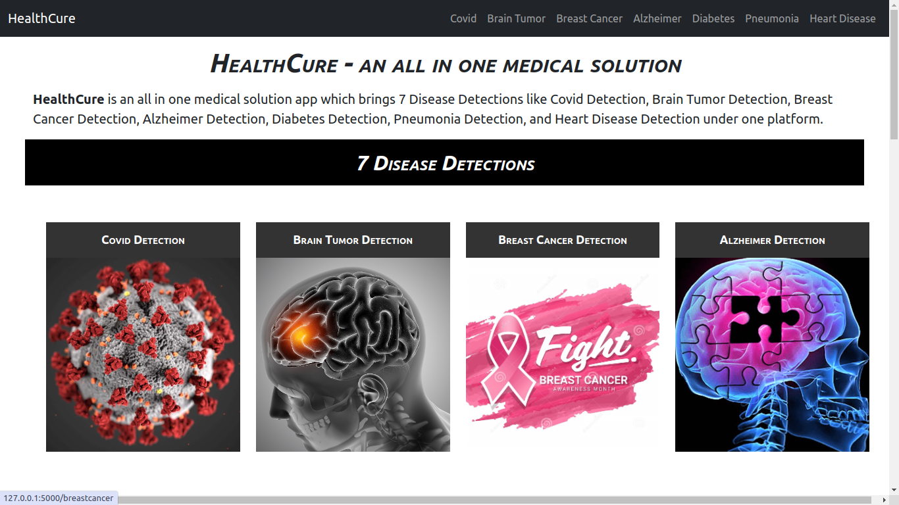
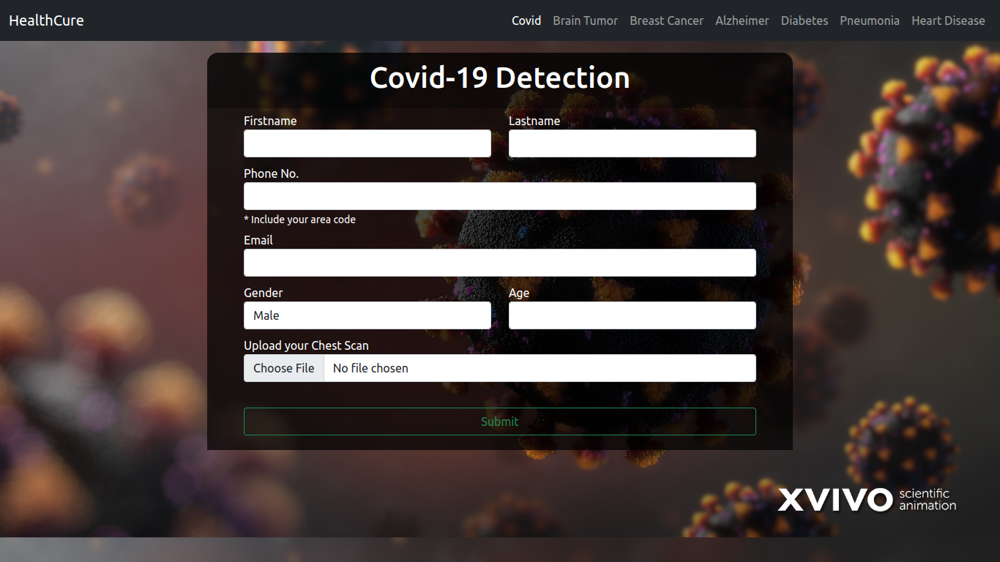
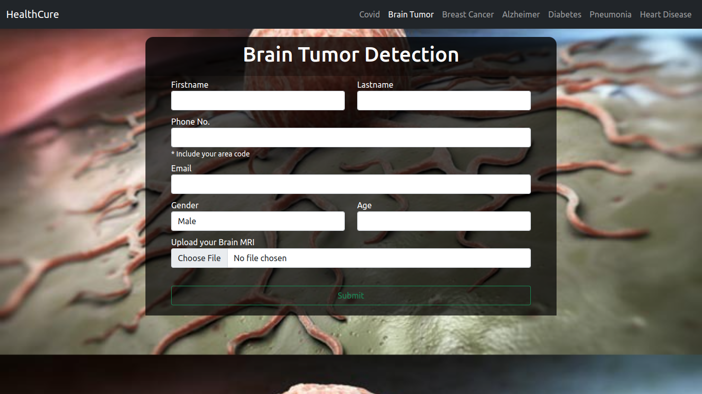
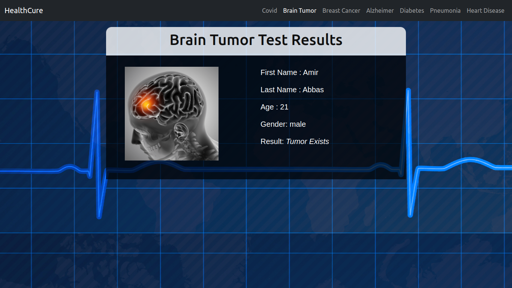

# Medical Diagnostic Web Application

This web application allows users to upload medical images and input data for various diseases to receive diagnostic results using pre-trained machine learning models. The application is built using Flask, a lightweight WSGI web application framework in Python.

## Features

- **COVID-19 Detection**: Predicts the presence of COVID-19 from chest X-ray images.
- **Breast Cancer Detection**: Predicts the likelihood of breast cancer based on medical data.
- **Brain Tumor Detection**: Identifies brain tumors from MRI images.
- **Diabetes Prediction**: Predicts diabetes based on medical data.
- **Alzheimer's Disease Detection**: Classifies the stage of Alzheimer's disease from MRI images.
- **Pneumonia Detection**: Detects pneumonia from chest X-ray images.
- **Heart Disease Prediction**: Predicts the presence of heart disease based on medical data.

## Prerequisites

- Python 3.7 or higher
- Flask
- OpenCV
- TensorFlow
- scikit-learn
- imutils
- joblib

## Installation

1. Clone the repository:

```bash
git clone https://github.com/your-repo/medical-diagnostic-app.git
cd medical-diagnostic-app
```

2. Create a virtual environment and activate it:

```bash
python -m venv venv
source venv/bin/activate  # On Windows, use `venv\Scripts\activate`
```

3. Install the required packages:

```bash
pip install -r requirements.txt
```

4. Place your trained models in the `models` directory with the following names:
   - `covid.h5`
   - `braintumor.h5`
   - `alzheimer_model.h5`
   - `diabetes.sav`
   - `heart_disease.pickle.dat`
   - `pneumonia_model.h5`
   - `cancer_model.pkl`

5. Create a folder named `static/uploads` to store the uploaded images:

```bash
mkdir -p static/uploads
```

## Running the Application

Start the Flask application:

```bash
python app.py
```

The application will be available at `http://127.0.0.1:5000/`.

## Project Structure

- `app.py`: Main Flask application file containing all routes and logic.
- `templates/`: Folder containing HTML templates for rendering web pages.
  - `homepage.html`
  - `covid.html`
  - `breastcancer.html`
  - `braintumor.html`
  - `diabetes.html`
  - `alzheimer.html`
  - `pneumonia.html`
  - `heartdisease.html`
  - `resultc.html`
  - `resultbt.html`
  - `resultd.html`
  - `resultbc.html`
  - `resulta.html`
  - `resultp.html`
  - `resulth.html`
- `static/uploads/`: Folder for storing uploaded images.
- `models/`: Folder for storing pre-trained machine learning models.

## Usage

1. Navigate to the homepage at `http://127.0.0.1:5000/`.
2. Select the type of diagnosis you want to perform (e.g., COVID-19, Brain Tumor).
3. Upload the required image or input the necessary data.
4. Click the submit button to get the diagnostic result.

## Screenshots

### Homepage


### COVID-19 Diagnosis Page


### Brain Tumor Diagnosis Page


### Diagnosis Result


## Functions

### Utility Functions

- `allowed_file(filename)`: Checks if the uploaded file is of an allowed type (`png`, `jpg`, `jpeg`).
- `preprocess_imgs(set_name, img_size)`: Resizes and applies VGG-16 preprocessing to the images.
- `crop_imgs(set_name, add_pixels_value=0)`: Finds the extreme points on the image and crops the rectangular region.

### Route Functions

- `home()`: Renders the homepage.
- `covid()`: Renders the COVID-19 diagnosis page.
- `breast_cancer()`: Renders the breast cancer diagnosis page.
- `brain_tumor()`: Renders the brain tumor diagnosis page.
- `diabetes()`: Renders the diabetes diagnosis page.
- `alzheimer()`: Renders the Alzheimer's diagnosis page.
- `pneumonia()`: Renders the pneumonia diagnosis page.
- `heartdisease()`: Renders the heart disease diagnosis page.

### Result Functions

- `resultc()`: Handles COVID-19 diagnosis and renders the result.
- `resultbt()`: Handles brain tumor diagnosis and renders the result.
- `resultd()`: Handles diabetes diagnosis and renders the result.
- `resultbc()`: Handles breast cancer diagnosis and renders the result.
- `resulta()`: Handles Alzheimer's diagnosis and renders the result.
- `resultp()`: Handles pneumonia diagnosis and renders the result.
- `resulth()`: Handles heart disease diagnosis and renders the result.

## License

This project is licensed under the MIT License. See the `LICENSE` file for more details.

## Acknowledgments

- Thanks to the creators of the datasets and models used in this application.
- Flask documentation and community for their support and resources.

## Contact

For any questions or suggestions, please open an issue or contact the repository owner.

---

By following the steps outlined above, you should be able to set up and run the medical diagnostic web application successfully.